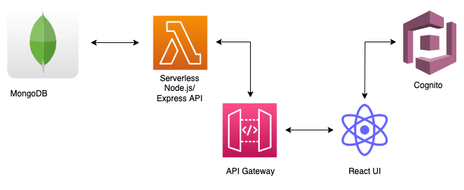

# Adventure Besties API

### Description

Adventure Besties is an application for people who enjoy planning and traveling. It will allow users to add a new adventure and plan it alongside their friends.

### High-level architecture

A Node Express API service running on AWS Lambda using the Serverless Framework.

### Deployment

Install dependencies with:

`npm install`

Deploy with:

`serverless deploy`

If you are deploying with a specific profile, deploy with:

`serverless deploy --aws-profile profilename`

### Local development

It is also possible to emulate API Gateway and Lambda locally by using serverless-offline plugin. In order to do that, execute the following command:

`serverless plugin install -n serverless-offline`

It will add the serverless-offline plugin to devDependencies in package.json file as well as will add it to plugins in serverless.yml.

After installation, you can start local emulation with:

`serverless offline`
